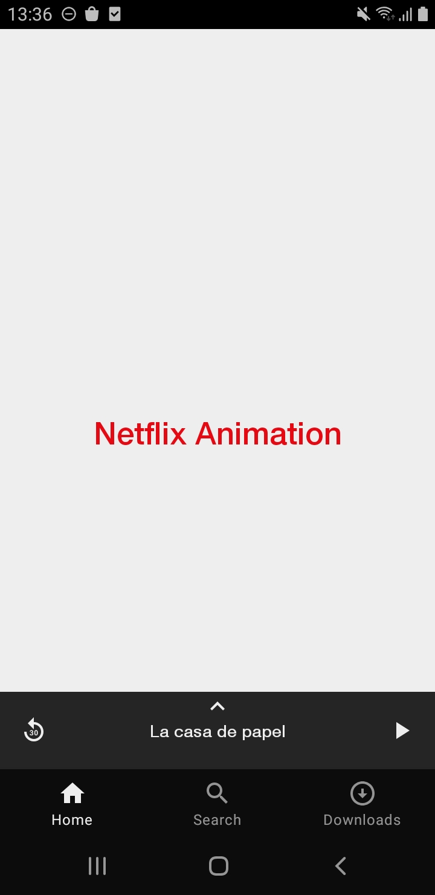
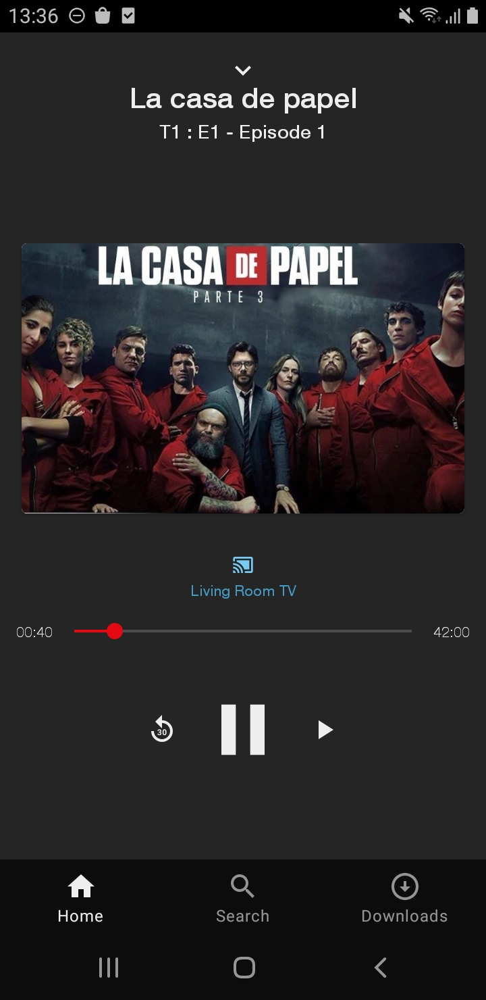

### Netflix Redesign screen casting video on TV - Android

This project is a sample redesign screen Netflix casting video on TV using Android Device.

#### Architecture and Libraries

* Kotlin Language <3 ✔
* API minimum 16 and target 30 ✔
* Material Design ✔
* Animation with MotionLayout ✔

# Screenshot
- Before

- After

# Git animation

Why I did this screen animation?

A days ago I was looking at the Netflix App and I found a "small animation bug" and then, I decide to re produce the screen using MotionLayout. :)
Check the bug below in the square icon show twice in the animation.

## Gif BUG

